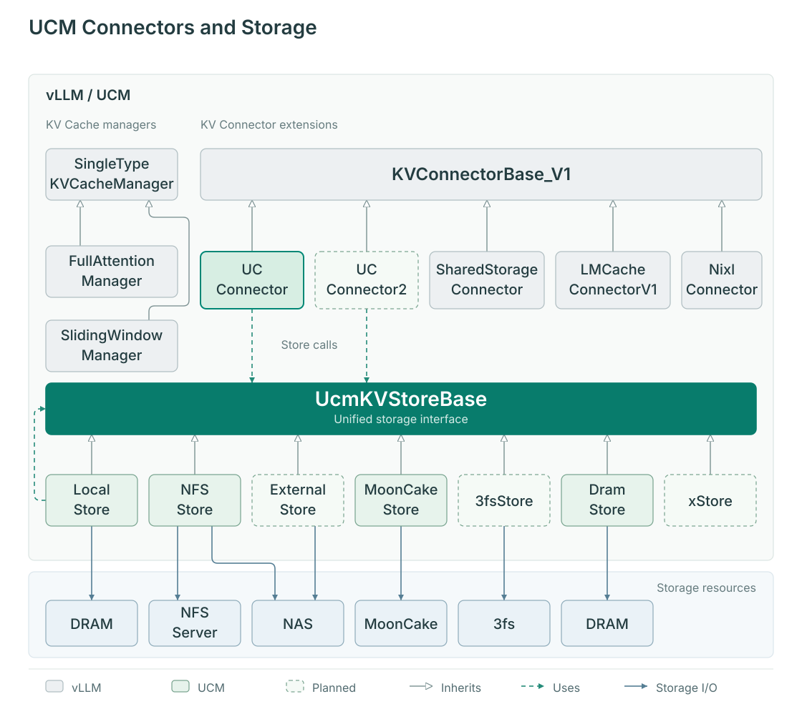

# Architecture

Inference engines usually keep active-request KV Cache in device memory. Device capacity and process lifetime limit retention: a prefix computed before a process exits may need to be computed again. UCM obtains block identifiers and buffer layouts through engine integration, saves completed KV blocks to external storage and loads compatible blocks for later requests.

## How components cooperate

The diagram retains the component names from the earlier architecture and shows how vLLM connectors access backends through UCM's storage interface. Dashed borders preserve the original planned-extension markers; current Store interfaces and engine entry points are described below.

On the KV Cache reuse path, engine integration translates scheduling information into storage operations. Store receives block identifiers and transfer descriptions rather than inferring the model structure. The table below details component responsibilities along this path.

| Component | Information it owns | Responsibility |
| --- | --- | --- |
| Inference engine | Requests, batches, model and device KV Cache | Schedule compute and buffers, execute Attention, manage request lifetime |
| Engine integration / Connector | Hooks, layouts, block identifiers and device addresses | Find reusable blocks, build transfer metadata, load/save and handle completion |
| Store interface and factory | Store names, configuration and task interfaces | Construct backends; expose lookup, prefetch, transfer and completion checks |
| Pipeline | Registered stage combinations and native Store objects | Connect storage stages and optional health-check wrappers |
| Storage stage | Host buffers or backend resources | Move data between devices, host memory, filesystems and remote stores |

## Where reuse happens

In vLLM, the Scheduler-side Connector queries external blocks and reports additional reusable tokens. After the engine allocates destination KV blocks, the Connector maps UCM blocks to engine blocks using the scheduling result. The Worker receives that metadata and loads Store data into engine-provided buffers. The corresponding load must complete before Attention uses the data.

The engine computes the unmatched portion and the Connector submits complete blocks for saving. Lookup, computation and storage have separate completion conditions. Finding a block, completing its load and finishing its save are distinct events. See the [request lifecycle](request-lifecycle.md) for per-step and per-layer ordering.

## Store and Pipeline

`UcmKVStoreBaseV1` is the Python interface used by engine integration. The V1 factory currently registers `UcmPipelineStore` and the public name `UcmNfsStore`, which resolves to the `UcmPcStoreV1` wrapper. Pipeline is a Store implementation, not a mandatory extra layer for every backend.

In `Cache|Posix`, Cache owns host buffers and device/host transfers, while Posix owns host/filesystem I/O. Pipeline loads a registered stage combination; names cannot be assembled arbitrarily. Other combinations support 3FS, compression or shared-memory storage. The [cache guide](cache-configuration/index.md) covers selection and configuration.

A health wrapper can prevent unhealthy stages from accepting new operations. Engine integration still handles misses, transfer failures and request completion. The wrapper does not retry inference requests.

## Engine-specific entry points

| Engine | Entry point | Important difference |
| --- | --- | --- |
| vLLM / vLLM-Ascend | `ucm/integration/vllm/ucm_connector.py` | Scheduler/Worker roles; direct, layerwise or model-specific Connector selected by layout |
| SGLang | `ucm/integration/sglang/unifiedcache_store.py` | HiCache owns host caching; the adapter uses Posix directly |

A common Store interface does not give these engines identical hooks or configuration formats. A backend extension owns storage resources; an engine or cache-layout extension belongs in integration. Continue with [how caching works](capability-principles.md) and [Store extension](extending-store.md).
