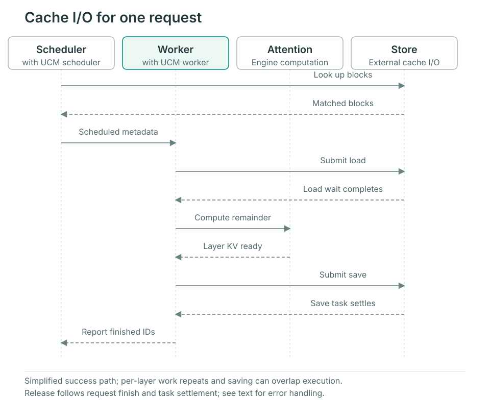

# Request lifecycle

Follow a regular vLLM prefix-cache request. Scheduler and Worker each own a UCM Connector and cooperate through engine-carried metadata, not a shared Python request object. Model-specific layouts and other engines differ as described below.

## Startup preparation

`UCMConnector` reads configuration and selects an implementation using KV layout, parallel execution and `use_layerwise`. After the engine creates KV buffers, `register_kv_caches()` gives the Worker tensor layouts and device addresses. These mappings serve multiple requests; each request's load/save range is determined after scheduling.

## From lookup to completion

The figure simplifies one successful reuse followed by saving. The Worker includes the engine's UCM hooks; Attention remains engine computation.

### 1. Scheduler finds a reusable prefix

The engine checks its own cache before calling `get_num_new_matched_tokens()`. The Connector generates UCM identifiers, queries external blocks after the already-computed portion, records request matches and returns additional reusable tokens.

The regular path returns `False` as the second result: it does not use the scheduling mode that resumes a request after asynchronous load completion. Store transfers can still be asynchronous, and the Worker must wait before consumption. `update_state_after_alloc()` is a no-op in the regular direct implementation; block mappings are created from scheduling output in the next step.

### 2. Scheduling output becomes Worker metadata

`build_connector_meta()` reads scheduled new/cached requests and engine block IDs to construct `UCMConnectorMetadata`. Load/save records map UCM identifiers to engine block positions, which the Worker resolves into device addresses.

A new request may load existing blocks and save new ones. Continuing chunked prefill usually saves newly completed blocks; resumption after preemption must reconsider loading. Metadata describes this step's work, not completed movement.

### 3. Worker loads; Attention waits before use

`start_load_kv()` submits loads using metadata and registered layouts. The direct implementation waits for this step's loads in that method; `wait_for_layer_load()` performs no additional per-layer wait.

The layerwise implementation submits the first layer in `start_load_kv()`. Before each Attention layer, `wait_for_layer_load()` waits for that layer and submits the next, allowing next-layer transfer to overlap current-layer computation. Invalid-block reports and Worker metadata carry load failures back to the engine and Scheduler instead of treating lookup hits as usable device data.

### 4. Save new blocks and track asynchronous tasks

The layerwise path submits saves in `save_kv_layer()`; the direct path primarily submits whole-block saves in `wait_for_save()`. Submission passes device synchronization events and source addresses so transfer reads data only after the required compute dependency.

`wait_for_save()` also polls earlier saves. Returning from the method does not mean every external write has ended. The Connector tracks pending tasks, associated requests and synchronization events. Store `check()` and `wait()` provide task completion checks.

### 5. Finish the request and release KV buffers

When the Scheduler calls `request_finished()`, the Connector checks whether asynchronous saving is involved. Returning `True` asks the engine to defer releasing the corresponding KV blocks. The Worker later waits for related pending saves in `get_finished()` and reports request IDs so the engine can continue resource reclamation.

This feedback ends transfer ownership; failed tasks also need a completed resource lifecycle. Verify errors and [restart/replay behavior](../user-guide/observability/verify-cache.md) to establish persistence. Permission to release a buffer does not establish a successful cache write.

## Layout and engine differences

| Path | What to inspect |
| --- | --- |
| MLA, CP and hybrid attention | Connector selection, rank consistency, shard layouts and model-specific save rules; `use_layerwise` alone does not identify the full path |
| SGLang | HiCache provides host buffers and the storage adapter uses Posix; follow its storage calls |

Start at `UCMConnector` in `ucm/integration/vllm/ucm_connector.py`, then follow `UCMDirectConnector`, `UCMLayerWiseConnector` and the selected model Connector. See [Store extension](extending-store.md) for task and error semantics.
