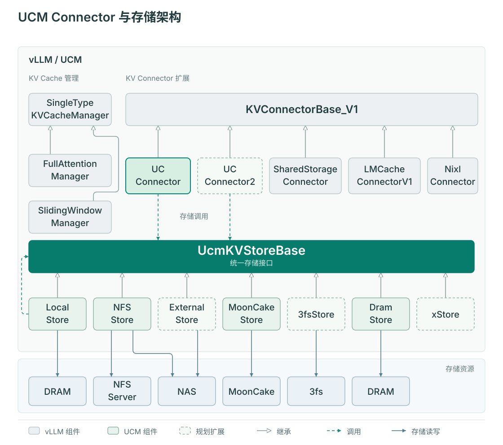

# 总体架构

推理引擎通常把活跃请求的 KV Cache 保存在设备内存中。设备容量和进程生命周期限制了这些数据的保留范围：进程退出后，先前计算过的前缀可能需要重新计算。UCM 通过引擎集成获取缓存块标识与缓冲区布局，将完成的 KV 块保存到外部存储，再为后续请求加载兼容的块。

## 组件如何协作

下图沿用旧版架构的组件命名，展示 vLLM Connector 如何通过 UCM 的存储接口接入不同后端。虚线边框保留原图中的规划扩展标识，当前 Store 接口和引擎接入点见下文。

在 KV Cache 复用路径中，引擎集成把调度信息转换为存储操作，Store 接收块标识和传输描述，不需要自行推断模型结构。下面进一步说明这条路径中各组件的职责。

| 组件 | 持有的信息 | 负责的动作 |
| --- | --- | --- |
| 推理引擎 | 请求、调度批次、模型、设备 KV Cache | 分配计算与缓冲区，执行 Attention，管理请求生命周期 |
| 引擎集成 / Connector | 引擎 hook、模型布局、块标识、设备地址 | 查询可复用块，生成传输元数据，加载、保存并处理完成状态 |
| Store 接口与工厂 | Store 名称、配置、传输任务接口 | 构造后端，提供查询、预取、读写和完成检查 |
| Pipeline | 已注册的阶段组合、原生 Store 对象 | 连接存储阶段，管理阶段调用及可选健康检查包装 |
| 存储阶段 | 主机缓冲或后端资源 | 在设备、主机、文件系统或远端存储之间搬运数据 |

## 一次复用发生在哪里

以 vLLM 为例，Scheduler 侧的 Connector 先查询外部块，告诉调度器还可以复用多少 token。引擎分配目标 KV 块后，Connector 根据调度结果生成 UCM 块与引擎块的对应关系。Worker 侧收到元数据，将 Store 数据加载到引擎提供的缓冲区；Attention 使用这些数据前，必须完成对应的加载等待。

引擎计算未命中的部分，Connector 再将可保存的完整块提交给 Store。查询、计算和存储各有完成条件，因此“查到块”“加载完成”“保存结束”是不同事件。完整的按步与按层调用顺序见[请求生命周期](request-lifecycle.md)。

## Store 与 Pipeline 的关系

`UcmKVStoreBaseV1` 是 Python 集成面对的 Store 接口。当前 V1 工厂的内置入口包括 `UcmPipelineStore` 和公开名称为 `UcmNfsStore` 的 `UcmPcStoreV1` 包装器。Pipeline 是一种 Store 实现，并不是所有 Store 都必须经过的独立层。

在 `Cache|Posix` 中，Cache 管理主机缓冲以及设备与主机之间的传输，Posix 管理主机与文件系统之间的 I/O。Pipeline 根据已注册名称加载阶段，不支持任意拼接名称。其他组合可以接入 3FS、压缩或共享内存存储。阶段组成和配置由[缓存指南](cache-configuration/index.md)说明。

健康包装器可以阻止不健康阶段接收新操作；引擎集成仍需处理查询未命中、传输失败和请求结束。包装器不会代替引擎重试请求。

## 不同引擎的接入点

| 引擎 | 接入点 | 需要保留的差异 |
| --- | --- | --- |
| vLLM / vLLM-Ascend | `ucm/integration/vllm/ucm_connector.py` | Scheduler/Worker 分工；根据布局选择 direct、layerwise 或模型专用 Connector |
| SGLang | `ucm/integration/sglang/unifiedcache_store.py` | HiCache 已管理主机缓存，适配器直接使用 Posix 阶段 |

共享 Store 接口不代表三个引擎具有相同的 hook 时序或配置格式。新增后端应在 Store 内处理后端资源；新增引擎或缓存布局应在集成层处理。接下来阅读[缓存工作原理](capability-principles.md)和[扩展 Store](extending-store.md)。
