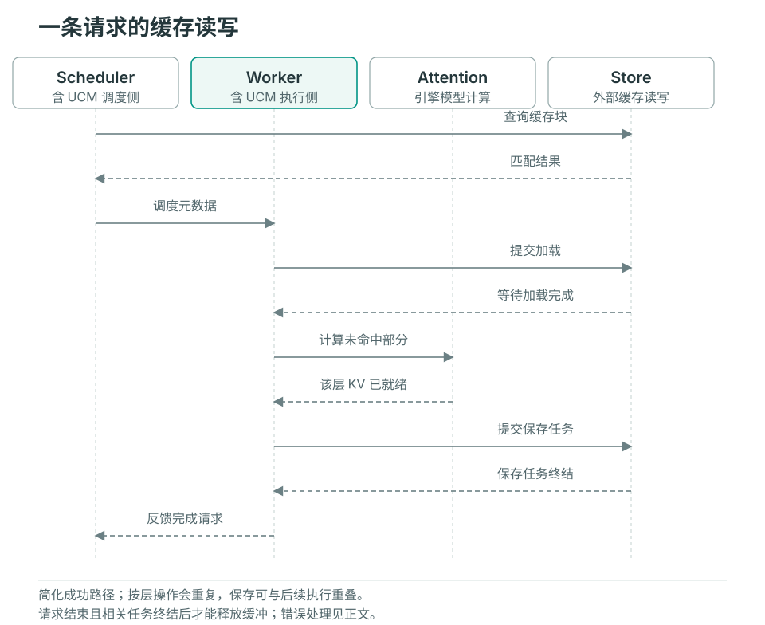

# 请求生命周期

本页跟随一条常规 vLLM 前缀缓存请求。Scheduler 和 Worker 各有自己的 UCM Connector；它们通过引擎传递的元数据协作，不共享同一个 Python 请求对象。模型专用布局和其他引擎的差异在文末说明。

## 启动时准备什么

`UCMConnector` 读取运行配置，并按模型 KV 布局、并行方式和 `use_layerwise` 选择具体实现。引擎创建 KV 缓冲后，`register_kv_caches()` 将张量布局和设备地址交给 Worker。此时建立的是可供多个请求使用的缓冲映射；请求本身的加载和保存范围要等调度后才能确定。

## 从查找到完成

图中简化展示一次成功复用及后续保存。Worker 一栏包含引擎的 UCM hook，Attention 的计算仍由推理引擎执行。

### 1. Scheduler 查询可以复用的前缀

引擎先检查自己的缓存，再调用 `get_num_new_matched_tokens()`。Connector 生成 UCM 块标识，查询引擎已计算部分之后的外部块，记录请求的匹配信息，并返回额外可复用 token 数。

常规路径返回的第二个值为 `False`，不采用异步加载完成后再由 Scheduler 恢复请求的调度方式；数据传输仍可能由 Store 异步执行，Worker 必须在使用前等待。`update_state_after_alloc()` 在常规 direct 路径中是空实现，实际块映射在下一步读取调度结果时生成。

### 2. 调度结果转换为 Worker 元数据

`build_connector_meta()` 读取本轮新请求、缓存请求和对应的引擎块编号，生成 `UCMConnectorMetadata`。其中的加载与保存记录把 UCM 块标识映射到引擎块位置，Worker 据此找到目标设备地址。

新请求可能同时需要加载已有块和保存新块；继续执行的 chunked prefill 通常只需保存新完成部分；被抢占后恢复的请求需要重新考虑加载。元数据描述本轮工作，不代表数据已经搬运。

### 3. Worker 加载，Attention 按需等待

`start_load_kv()` 使用元数据和启动时注册的布局，向 Store 提交加载。在 direct 路径中，该方法会等待本轮加载；`wait_for_layer_load()` 不再执行逐层等待。

在 layerwise 路径中，`start_load_kv()` 提交首层加载。每层 Attention 前，`wait_for_layer_load()` 等待该层任务，然后提交下一层加载。这样下一层传输可以与当前层计算重叠。失败的加载通过无效块和 Worker 元数据反馈给引擎及 Scheduler，避免把查询命中直接当作可用设备数据。

### 4. 保存新块并跟踪异步任务

layerwise 路径在 `save_kv_layer()` 提交当前层的保存任务；direct 路径主要在 `wait_for_save()` 提交整块保存。提交时将设备同步事件和源缓冲地址交给传输路径，保证设备数据满足读取条件。

`wait_for_save()` 还会轮询已有保存任务。方法返回不等于所有外部写入已经结束；待完成任务、关联请求和同步事件仍由 Connector 跟踪。Store 的 `check()` 和 `wait()` 承担任务完成检查。

### 5. 请求结束与缓存缓冲释放

Scheduler 调用 `request_finished()` 时，Connector 检查请求是否涉及异步保存。返回 `True` 会请求引擎延迟释放对应 KV 块。Worker 后续通过 `get_finished()` 等待相关待完成保存并报告请求集合，供引擎继续资源回收。

这条完成反馈用于结束传输占用；失败任务也需要结束资源生命周期。要确认持久化复用成功，还需检查错误并执行[重启重放验证](../user-guide/observability/verify-cache.md)，不能把资源可释放等同于缓存已正确写入。

## 布局和引擎差异

| 路径 | 阅读时需要关注 |
| --- | --- |
| MLA、CP、hybrid attention 等 | Connector 选择、rank 间匹配、分片布局及模型专用保存规则；不能仅根据 `use_layerwise` 推断整个执行路径 |
| SGLang | HiCache 提供主机缓冲，存储适配器对接 Posix；使用其存储接口调用链 |

源码从 `ucm/integration/vllm/ucm_connector.py` 的 `UCMConnector` 进入，再沿 `UCMDirectConnector`、`UCMLayerWiseConnector` 和所选模型 Connector 阅读。Store 的完成与错误语义见[扩展 Store](extending-store.md)。
